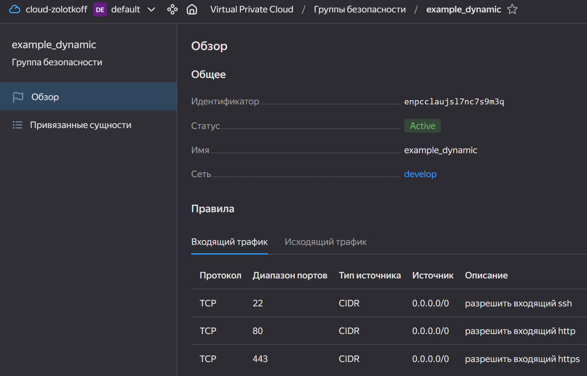
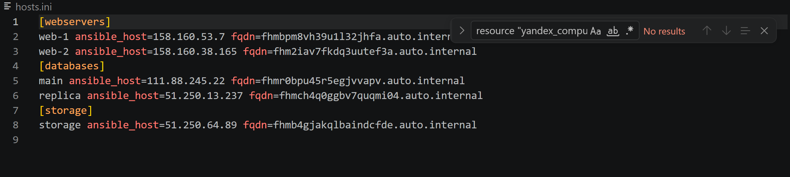

# Домашнее задание «Управляющие конструкции в коде Terraform»

Ветка: `terraform-03`
Версия Terraform: `~> 1.12.0` (используется `1.12.2`)
Провайдер: `yandex-cloud/yandex` (через зеркало `terraform-mirror.yandexcloud.net`)

> Все ВМ создаются как **прерываемые** (`scheduling_policy { preemptible = true }`) для экономии гранта.
> Хардкод-значений нет: параметры вынесены в переменные, ссылки на ресурсы — через `resource.name.id`.

---

## Задание 1

Проект из `03/src` инициализирован и применён. Создаются сеть, подсеть и «Группа безопасности» с `dynamic`-блоками `ingress`/`egress`.

```
Plan: 3 to add, 0 to change, 0 to destroy.
Apply complete! Resources: 3 added, 0 changed, 0 destroyed.
```

Входящие правила группы безопасности `example_dynamic` (SSH 22, HTTP 80, HTTPS 443):



---

## Задание 2

### 2.1. Две одинаковые ВМ `web-1` и `web-2` через `count`

Файл `count-vm.tf`. Имена формируются через `count.index + 1`, чтобы получить `web-1`/`web-2` (а не `web-0`/`web-1`). Назначена группа безопасности из Задания 1.

```hcl
data "yandex_compute_image" "ubuntu" {
  family = var.image_family
}

resource "yandex_compute_instance" "web" {
  count = 2
  name  = "web-${count.index + 1}" # web-1, web-2

  platform_id = "standard-v3"
  zone        = var.default_zone

  resources {
    cores         = var.vm_web.cores
    memory        = var.vm_web.memory
    core_fraction = var.vm_web.core_fraction
  }

  boot_disk {
    initialize_params {
      image_id = data.yandex_compute_image.ubuntu.id
      size     = var.vm_web.disk_gb
    }
  }

  scheduling_policy {
    preemptible = true
  }

  network_interface {
    subnet_id          = yandex_vpc_subnet.develop.id
    security_group_ids = [yandex_vpc_security_group.example.id]
    nat                = true
  }

  metadata = {
    ssh-keys = "ubuntu:${local.ssh_key}"
  }

  depends_on = [yandex_compute_instance.db] # см. п. 2.3
}
```

### 2.2. Две разные ВМ БД `main` и `replica` через `for_each`

Файл `for_each-vm.tf`. Обе ВМ описаны одной общей переменной типа `list(object(...))`. Поскольку `for_each` не работает со списком напрямую, список преобразуется в map по ключу `vm_name` через `for`-выражение.

Переменная (в `variables.tf`):

```hcl
variable "each_vm" {
  type = list(object({
    vm_name     = string
    cpu         = number
    ram         = number
    disk_volume = number
  }))
  default = [
    { vm_name = "main",    cpu = 2, ram = 2, disk_volume = 10 },
    { vm_name = "replica", cpu = 2, ram = 4, disk_volume = 15 }
  ]
  description = "Параметры ВМ баз данных (for_each)"
}
```

Ресурс:

```hcl
resource "yandex_compute_instance" "db" {
  for_each = { for vm in var.each_vm : vm.vm_name => vm } # list -> map по vm_name
  name     = each.key                                     # main / replica

  platform_id = "standard-v3"
  zone        = var.default_zone

  resources {
    cores         = each.value.cpu
    memory        = each.value.ram
    core_fraction = 20
  }

  boot_disk {
    initialize_params {
      image_id = data.yandex_compute_image.ubuntu.id
      size     = each.value.disk_volume
    }
  }

  scheduling_policy {
    preemptible = true
  }

  network_interface {
    subnet_id          = yandex_vpc_subnet.develop.id
    security_group_ids = [yandex_vpc_security_group.example.id]
    nat                = true
  }

  metadata = {
    ssh-keys = "ubuntu:${local.ssh_key}"
  }
}
```

### 2.3. Порядок создания: `web` после `db`

Между `web` и `db` нет ссылок, поэтому «естественной» зависимости нет — она задана явно через `depends_on = [yandex_compute_instance.db]` в ресурсе `web` (см. код п. 2.1).

### 2.4. Чтение SSH-ключа функцией `file` в local-переменной

Файл `locals.tf`. Ключ читается один раз и переиспользуется всеми ВМ в блоке `metadata`. Путь обёрнут в `pathexpand()`, т.к. функция `file()` сама не раскрывает `~`.

```hcl
locals {
  ssh_key = file(pathexpand("~/.ssh/id_rsa.pub"))
}
```

### Проверка выполнения

Порядок применения подтверждает работу `depends_on` — сначала полностью создаются `db`, и только потом `web`:

```
yandex_compute_instance.db["main"]:    Creation complete after 40s [id=fhmr0bpu45r5egjvvapv]
yandex_compute_instance.db["replica"]: Creation complete after 41s [id=fhmch4q0ggbv7quqmi04]
yandex_compute_instance.web[1]: Creating...
yandex_compute_instance.web[0]: Creating...
yandex_compute_instance.web[0]: Creation complete after 39s [id=fhmbpm8vh39u1l32jhfa]
yandex_compute_instance.web[1]: Creation complete after 40s [id=fhm2iav7fkdq3uutef3a]
Apply complete! Resources: 4 added, 0 changed, 0 destroyed.
```

Адресация: `db["main"]`/`db["replica"]` — по строковому ключу (`for_each`), `web[0]`/`web[1]` — по числовому индексу (`count`).

Список созданных ВМ:

```
+----------------------+---------+---------------+---------+----------------+-------------+
|          ID          |  NAME   |    ZONE ID    | STATUS  |  EXTERNAL IP   | INTERNAL IP |
+----------------------+---------+---------------+---------+----------------+-------------+
| fhm2iav7fkdq3uutef3a | web-2   | ru-central1-a | RUNNING | 158.160.38.165 | 10.0.1.35   |
| fhmbpm8vh39u1l32jhfa | web-1   | ru-central1-a | RUNNING | 158.160.53.7   | 10.0.1.32   |
| fhmch4q0ggbv7quqmi04 | replica | ru-central1-a | RUNNING | 51.250.13.237  | 10.0.1.6    |
| fhmr0bpu45r5egjvvapv | main    | ru-central1-a | RUNNING | 111.88.245.22  | 10.0.1.22   |
+----------------------+---------+---------------+---------+----------------+-------------+
```

`main` и `replica` действительно разные по ресурсам (проверка `for_each` с разными параметрами):

```
# main:    memory = 2147483648 (2 ГБ), cores = 2
# replica: memory = 4294967296 (4 ГБ), cores = 2
```

---

## Задание 3

### 3.1. Три одинаковых диска 1 ГБ через `count`
### 3.2. Одиночная ВМ `storage` с `dynamic secondary_disk`

Файл `disk_vm.tf`. Диски созданы через `count`, ВМ `storage` — одиночная (без `count`/`for_each`, как требует п. 3.2). Дополнительные диски подключены через `dynamic secondary_disk` с итерацией по splat-выражению `yandex_compute_disk.data[*].id`, которое разворачивает все три диска в список их id.

```hcl
resource "yandex_compute_disk" "data" {
  count = 3
  name  = "disk-${count.index + 1}" # disk-1, disk-2, disk-3
  zone  = var.default_zone
  size  = 1
}

resource "yandex_compute_instance" "storage" {
  name        = "storage" # без count/for_each — одна ВМ
  platform_id = "standard-v3"
  zone        = var.default_zone

  # ... resources / boot_disk / scheduling_policy / network_interface / metadata ...

  dynamic "secondary_disk" {
    for_each = yandex_compute_disk.data[*].id
    content {
      disk_id = secondary_disk.value
    }
  }
}
```

Диски создаются первыми (у `storage` неявная зависимость через `disk_id`):

```
yandex_compute_disk.data[0..2]: Creation complete (disk-1, disk-2, disk-3)
yandex_compute_instance.storage: Creation complete after 39s [id=fhmb4gjakqlbaindcfde]
Apply complete! Resources: 4 added, 0 changed, 0 destroyed.
```

---

## Задание 4

Файл `ansible.tf` + шаблон `hosts.tftpl`. Динамический ansible-inventory на 3 группы из 5 ВМ, собранных из трёх источников с приведением каждого к списку объектов:

- `webservers` ← `yandex_compute_instance.web` (`count`, уже список)
- `databases` ← `values(yandex_compute_instance.db)` (`for_each` map → список через `values()`)
- `storage` ← `[yandex_compute_instance.storage]` (один объект → обёрнут в список)

Ресурс, рендерящий шаблон:

```hcl
resource "local_file" "inventory" {
  content = templatefile("${path.module}/hosts.tftpl", {
    webservers = yandex_compute_instance.web
    databases  = values(yandex_compute_instance.db)
    storage    = [yandex_compute_instance.storage]
  })
  filename = "${abspath(path.module)}/hosts.ini"
}
```

Шаблон `hosts.tftpl` (директивы `%{ for ... ~}` делают inventory динамическим — каждая группа обработает и 2, и 999 ВМ; добавлена переменная `fqdn`):

```
[webservers]
%{ for i in webservers ~}
${i.name} ansible_host=${i.network_interface[0].nat_ip_address} fqdn=${i.fqdn}
%{ endfor ~}
[databases]
%{ for i in databases ~}
${i.name} ansible_host=${i.network_interface[0].nat_ip_address} fqdn=${i.fqdn}
%{ endfor ~}
[storage]
%{ for i in storage ~}
${i.name} ansible_host=${i.network_interface[0].nat_ip_address} fqdn=${i.fqdn}
%{ endfor ~}
```

Результат — сгенерированный `hosts.ini`:

```
[webservers]
web-1 ansible_host=158.160.53.7 fqdn=fhmbpm8vh39u1l32jhfa.auto.internal
web-2 ansible_host=158.160.38.165 fqdn=fhm2iav7fkdq3uutef3a.auto.internal
[databases]
main ansible_host=111.88.245.22 fqdn=fhmr0bpu45r5egjvvapv.auto.internal
replica ansible_host=51.250.13.237 fqdn=fhmch4q0ggbv7quqmi04.auto.internal
[storage]
storage ansible_host=51.250.64.89 fqdn=fhmb4gjakqlbaindcfde.auto.internal
```

FQDN сформированы автоматически (зона `auto.internal`), т.к. переменная `hostname` у ВМ не задавалась.

Скриншот файла:



---

## Удаление ресурсов

После сдачи все созданные ресурсы удалены командой `terraform destroy`.
