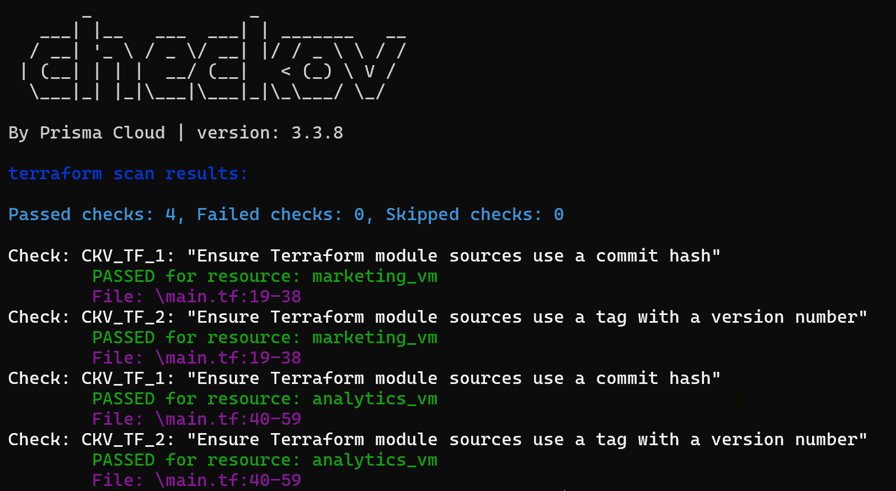
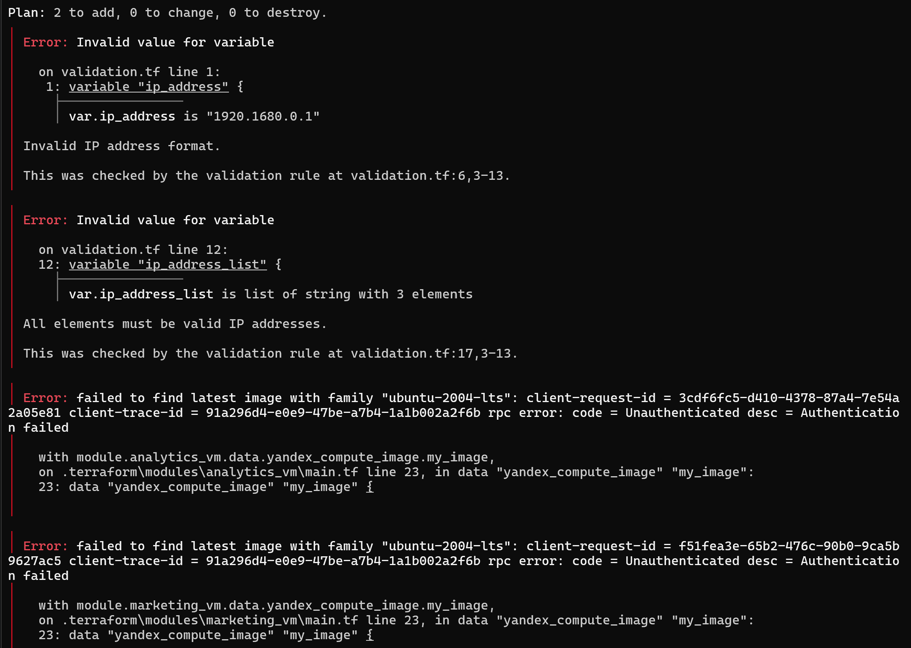
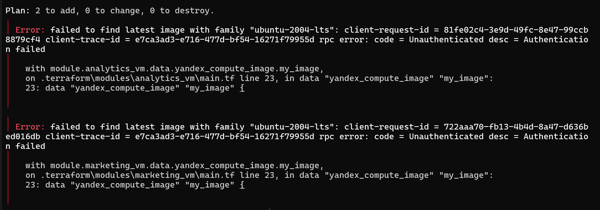

# Домашнее задание «Использование Terraform в команде»

Ветка: `terraform-05`
Версия Terraform: `1.12.2`
Провайдеры: `yandex-cloud/yandex ~> 0.215.0`, `hashicorp/template ~> 2.2.0`


---

## Задание 1. Проверка кода tflint и checkov

Код из ДЗ-04 (`04/src`) проверен двумя линтерами **без** `terraform init` (статический анализ).

### tflint (v0.63.1)

7 замечаний, сводятся к 3 типам:

| # | Тип проблемы | Правило | Кол-во |
|---|---|---|---|
| 1 | Отсутствует ограничение версии провайдера в `required_providers` | `terraform_required_providers` | 2 |
| 2 | Источник модуля использует ветку `main` вместо фиксированного тега/хеша | `terraform_module_pinned_source` | 2 |
| 3 | Объявленные, но неиспользуемые переменные | `terraform_unused_declarations` | 3 |


### checkov (v3.3.8)

4 замечания, сводятся к 2 типам:

| # | Тип проблемы | Правило | Кол-во |
|---|---|---|---|
| 1 | Источник модуля не закреплён commit-хешем (supply-chain риск) | `CKV_TF_1` | 2 |
| 2 | Источник модуля не использует тег с номером версии | `CKV_TF_2` | 2 |



### Итого — типы ошибок без дублей

1. **Отсутствует ограничение версии провайдера** (tflint) — без `version` в `required_providers` при `init` может подтянуться несовместимая версия.
2. **Источник модуля не зафиксирован** (tflint + checkov) — ветка `main` может измениться в любой момент, код становится невоспроизводимым; риск supply-chain атаки.
3. **Неиспользуемые переменные** (tflint) — мёртвый код, усложняет поддержку.

---

## Задание 2. Remote state с блокировками

### Подготовка инфраструктуры для remote state

Создан S3-бакет и сервисный аккаунт с минимальными правами:

    yc iam service-account create --name tf-state-sa
    yc resource-manager folder add-access-binding default --role storage.editor --subject serviceAccount:<SA_ID>
    yc iam access-key create --service-account-name tf-state-sa
    yc storage bucket create --name zolotkoff-tf-state --max-size 1073741824


### Настройка backend

В `providers.tf` добавлен блок `backend "s3"` с встроенным механизмом блокировок (`use_lockfile = true`):

```hcl
backend "s3" {
  bucket = "zolotkoff-tf-state"
  key    = "terraform.tfstate"
  region = "ru-central1"

  use_lockfile = true

  endpoints = {
    s3 = "https://storage.yandexcloud.net"
  }

  skip_region_validation      = true
  skip_credentials_validation = true
  skip_requesting_account_id  = true
  skip_s3_checksum            = true
}
```

Ключи доступа передаются через переменные окружения `AWS_ACCESS_KEY_ID` / `AWS_SECRET_ACCESS_KEY` (не хардкодятся в код).

### Миграция state в S3

    terraform init -migrate-state
    Successfully configured the backend "s3"!


### Проверка блокировки (пункты 4-5)

В первом окне запущен `terraform console` (захватывает лок). Во втором окне `terraform apply` получил ошибку блокировки:

    Error: Error acquiring the state lock
    Lock Info:
      ID:        c8bbaca5-8790-d16c-4639-736a0a7de3e6
      Path:      zolotkoff-tf-state/terraform.tfstate
      Operation: OperationTypeInvalid
      Who:       PRN-WS-01\Paranoiak@prn-ws-01
      Version:   1.12.2

Механизм: `use_lockfile = true` создаёт файл `terraform.tfstate.tflock` в том же бакете. Повторная попытка записи лока получает `412 PreconditionFailed` от S3.


### Принудительная разблокировка (пункт 6)

    terraform force-unlock c8bbaca5-8790-d16c-4639-736a0a7de3e6
    Terraform state has been successfully unlocked!


---

## Задание 3. Hotfix + Pull Request

### Ветка terraform-hotfix

Из `terraform-05` создана ветка `terraform-hotfix`, в которой исправлены все 3 типа проблем из Задания 1:

1. **Добавлены версии провайдеров** в `required_providers`: `yandex ~> 0.215.0`, `template ~> 2.2.0`.
2. **Источник модуля закреплён commit-хешем**: `?ref=de7090ae115ee5059cd81053a808af079c325e01` (вместо `?ref=main`).
3. **Удалены неиспользуемые переменные**: `vms_ssh_root_key`, `vm_web_name`, `vm_db_name`.

### Результаты линтеров после исправлений

**tflint:** 0 issue(s) found

**checkov:** Passed checks: 4, Failed checks: 0, Skipped checks: 0

**terraform plan:** Plan: 4 to add, 0 to change, 0 to destroy.


### Pull Request

PR `terraform-hotfix` -> `terraform-05`: https://github.com/Zolotkoff/ter-homeworks/pull/1

Код в `terraform-05` не вливается (по условию задания).

---

## Задание 4. Переменные с валидацией IP

Файл `validation.tf`. Две переменные с блоком `validation`, проверяющим формат IP-адреса через regex.

### Одиночный IP-адрес

```hcl
variable "ip_address" {
  type        = string
  description = "ip-адрес"
  default     = "192.168.0.1"

  validation {
    condition     = can(regex("^((25[0-5]|2[0-4][0-9]|[01]?[0-9][0-9]?)\\.){3}(25[0-5]|2[0-4][0-9]|[01]?[0-9][0-9]?)$", var.ip_address))
    error_message = "Invalid IP address format."
  }
}
```

### Список IP-адресов

```hcl
variable "ip_address_list" {
  type        = list(string)
  description = "список ip-адресов"
  default     = ["192.168.0.1", "1.1.1.1", "127.0.0.1"]

  validation {
    condition     = alltrue([for ip in var.ip_address_list : can(regex("^((25[0-5]|2[0-4][0-9]|[01]?[0-9][0-9]?)\\.){3}(25[0-5]|2[0-4][0-9]|[01]?[0-9][0-9]?)$", ip))])
    error_message = "All elements must be valid IP addresses."
  }
}
```

### Тесты

| Тест | Значение | Результат |
|---|---|---|
| Невалидный IP | `"1920.1680.0.1"` | `Error: Invalid IP address format.` |
| Невалидный список | `["1920.1680.0.1", "1.1.1.1", "127.0.0.1"]` | `Error: All elements must be valid IP addresses.` |
| Валидный IP | `"192.168.0.1"` | `terraform plan` — ошибок валидации нет |
| Валидный список | `["192.168.0.1", "1.1.1.1", "127.0.0.1"]` | `terraform plan` — ошибок валидации нет |

Примечание: `terraform validate` не проверяет validation-блоки переменных, которые не используются в ресурсах. Проверка запускалась через `terraform plan`.





---

## Удаление ресурсов

Инфраструктура (ВМ, сеть, подсеть) была удалена ранее (в рамках ДЗ-04). S3-бакет `zolotkoff-tf-state` и сервисный аккаунт `tf-state-sa` оставлены — они инфраструктура самого remote state, а не объект ДЗ, и нужны для дальнейшей работы.
